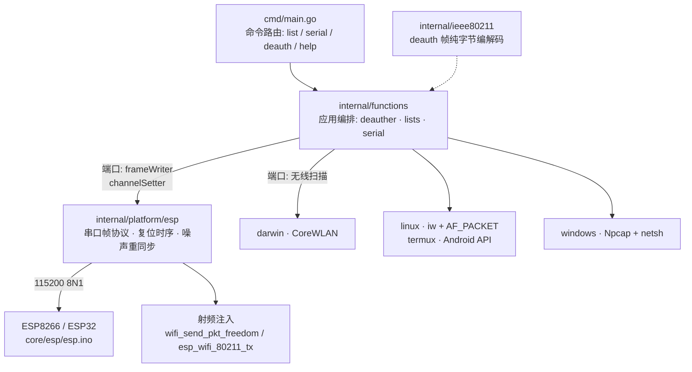

# WifiSec

<p align="center">
  
</p>

<p align="center">
  <strong>ESP 协处理器 WiFi 安全测试工具</strong>
</p>

<p align="center">
  作者：<strong>钟智强</strong> · 哪吒网络安全
</p>

<p align="center">
  <a href="https://go.dev/"></a>
  <a href="#固件烧录"></a>
  <a href="#工作方式"></a>
  <a href="#编译与运行"></a>
  <a href="https://github.com/ctkqiang/wifisec/actions/workflows/compile-cross-platform.yml"></a>
  <a href="LICENSE"></a>
</p>

---

## 目录

- [项目概述](#项目概述)
- [工作方式](#工作方式)
- [系统架构](#系统架构)
- [命令一览](#命令一览)
- [串口协议](#串口协议)
- [项目结构](#项目结构)
- [下载](#下载)
- [编译与运行](#编译与运行)
- [固件烧录](#固件烧录)
- [测试](#测试)
- [安全最佳实践](#安全最佳实践)
- [许可证](#许可证)

---

## 项目概述

WifiSec 是 Go 编写的无线安全测试工具，采用 Hexagonal Architecture：应用编排不感知底层注入方式，平台能力收敛在 adapter 层。

**核心特性：**

| 特性             | 描述                                                                                |
| ---------------- | ----------------------------------------------------------------------------------- |
| 协处理器注入     | 帧注入跑在 ESP8266/ESP32 板载射频上，宿主机零依赖，macOS/Linux/Windows/Termux 免 root |
| 能力位图协商     | 握手时固件上报协议版本与能力位（bit0 = 5GHz），主机按能力分发，不猜板型               |
| 全链路日志       | 复位握手 → 扫描 → 命中 → 注入 → Ctrl-C 统计，每阶段可观测，串口占用进程点名           |
| 802.11 帧构造    | deauth 帧在 `internal/ieee80211` 纯字节编解码层构造，与传输介质解耦，可独立单测        |
| 跨平台原生路径   | Linux `iw`+AF_PACKET、Windows Npcap+WlanHelper、macOS CoreWLAN 扫描，按构建标签分发    |
| SSID/BSSID 双选  | 目标可传 SSID（同名多 AP 全部命中、轮流切信道）或 BSSID（精确锁定）                   |
| 串口诊断         | VID:PID 芯片识别、复位时序、74880 噪声重同步、占用进程（lsof）点名                    |
| 表驱动测试       | 协议编解码、AP 解析去重、MAC 归一化、CLI 校验等关键逻辑集中在 `tests/` 独立 package   |

**中华人民共和国境内法律红线：**《中华人民共和国网络安全法》第二十七条明确禁止任何个人和组织从事非法侵入他人网络、干扰他人网络正常功能、窃取网络数据等危害网络安全的活动；对他人无线网络实施 deauth 干扰，可能同时触犯《中华人民共和国刑法》第二百八十五条第三款（提供侵入、非法控制计算机信息系统程序、工具罪）与第二百八十六条（破坏计算机信息系统罪）。本工具仅限**自有网络或已获书面授权**的测试环境使用，使用者须自行确认符合所在地法律法规。

---

## 工作方式

两条注入路径按构建与平台自动分发：

| 路径               | 原理                                                                 | 平台                           | 权限             |
| ------------------ | -------------------------------------------------------------------- | ------------------------------ | ---------------- |
| **ESP 协处理器**（默认） | 帧注入在板载 ESP8266/ESP32 射频上完成，宿主机经 USB 串口下发协议帧     | macOS / Linux / Windows / Termux | 无需 root        |
| Linux 原生         | `iw` 创建 monitor 接口 + `AF_PACKET` 原始套接字                       | Linux / Termux(Android)        | root 或 CAP_NET_RAW |
| Windows 原生       | Npcap 驱动注入 + WlanHelper 切 monitor                                | Windows                        | 管理员 + Npcap   |
| macOS 原生         | 不可用——Apple 未开放任何公开的 802.11 帧注入 API，返回精确技术说明     | macOS                          | -                |

> macOS 用户走协处理器路径即可：插一块 ESP8266 开发板（约十元），烧录固件后全部功能免 root 可用，同时绕过系统对 BSSID 的定位脱敏。

---

## 系统架构

应用层只依赖端口（frameWriter / channelSetter / wirelessScanner 等），五个平台 adapter 提供实现；串口帧协议见下文。



> 📁 图表源码：[flow.puml](docs/diagram/flow.puml)（deauth 执行流程）| [sequence.puml](docs/diagram/sequence.puml)（串口协议时序）

---

## 命令一览

```bash
wifisec list                              # 列出无线接口与周边网络
wifisec serial                            # 列出 USB 串口设备（协处理器入口排查）
wifisec deauth <ssid|bssid> [串口]        # 对目标持续发送 deauth 帧，Ctrl-C 停止
wifisec help                              # 用法总览
```

| 命令      | 功能                       | 详细文档                                                 |
| --------- | -------------------------- | -------------------------------------------------------- |
| `list`    | 无线接口枚举与周边网络扫描 | [wifi_list.md](docs/feature/wifi_list.md)                |
| `serial`  | 串口设备发现与 VID:PID 判读 | [wifi_serial.md](docs/feature/wifi_serial.md)            |
| `deauth`  | 802.11 deauthentication 帧注入 | [wifi_deauth.md](docs/feature/wifi_deauth.md)        |
| 文档站    | HTML/JS/CSS 静态文档        | [docs/index.html](docs/index.html)（Arco Design 风格）   |

---

## 串口协议

主机 ↔ 固件帧格式（小端，双向各一个魔数防方向错乱）：

| 方向        | 帧头     | 帧格式                                        |
| ----------- | -------- | --------------------------------------------- |
| 主机 → ESP  | `0xA5`   | `[A5][cmd][len_lo][len_hi][payload]`          |
| ESP → 主机  | `0x5A`   | `[5A][cmd][len_lo][len_hi][payload]`          |

| cmd          | 方向      | 含义     | payload                                          |
| ------------ | --------- | -------- | ------------------------------------------------ |
| `0x00`       | 主机→ESP  | PING     | 无                                               |
| `0x00`       | ESP→主机  | PONG     | 协议版本(1) + 能力位图(1)，bit0 = 5GHz            |
| `0x01`       | 主机→ESP  | 扫描     | 无                                               |
| `0x01`       | ESP→主机  | 扫描条目 | bssid(6) + channel(1) + rssi(1) + ssidLen(1) + ssid |
| `0x02`       | ESP→主机  | 扫描结束 | 无                                               |
| `0x02`       | 主机→ESP  | 注入     | 信道(1) + 802.11 帧（已剥 radiotap）              |
| `0x04`       | ESP→主机  | 错误     | 出错命令(1) + 错误码(1)                           |

两个关键设计：

- **复位时序**——打开串口先 DTR 拉低 → RTS 复位 100ms → 释放。NodeMCU 自动复位电路把 DTR 接到 GPIO0，驱动默认电平会把芯片锁进 ROM 下载模式（115200 完全静默）。
- **噪声重同步**——ESP 上电以 74880 输出启动日志，在 115200 下是随机字节；解析器逐字节丢弃直至帧头 `0x5A`，残缺帧保留待下一段拼齐。

---

## 项目结构

```
wifisec/
├── cmd/main.go                          # 入口：命令注册与路由（list/serial/deauth/help）
├── core/esp/esp.ino                     # 协处理器固件（ESP8266/ESP32 全系，编译期条件分支）
├── internal/
│   ├── constants/                       # 开发者元数据等常量
│   ├── functions/                       # 应用编排：deauther · lists · serial · help
│   ├── ieee80211/frame.go               # deauth 帧纯字节编解码（与介质解耦，可独立单测）
│   ├── model/                           # wifi / command / author 领域模型
│   ├── platform/
│   │   ├── darwin/                      # CoreWLAN 扫描 + reexec（TCC 定位授权 bundle）
│   │   ├── esp/esp.go                   # 串口帧协议 · 复位时序 · 噪声重同步 · 能力位图
│   │   ├── linux/                       # iw 解析 · monitor · AF_PACKET 注入 · Android
│   │   ├── termux/                      # Android Termux API 适配
│   │   └── windows/                     # netsh 解析 · Npcap/WlanHelper 注入
│   ├── radio/regulatory.go              # 信道合规边界
│   ├── security/permission.go           # 按 operation 判断权限，不无条件要求 root
│   └── utilities/                       # argv · logger · platform
├── tests/                               # 全部 *_test.go（独立 package，表驱动测试）
├── docs/
│   ├── index.html                       # 文档站入口（Arco Design 风格静态站）
│   ├── logo.svg                         # 项目 Logo
│   ├── src/style/ · src/scripts/        # 文档站样式（SCSS 源 + 编译产物）与交互脚本
│   ├── diagram/                         # PlantUML：执行流程 + 串口协议时序
│   └── feature/                         # wifi_list / wifi_serial / wifi_deauth 详细文档
├── Makefile                             # build / list / test / 等构建编排
└── .githooks/                           # Conventional Commits 提交信息校验钩子
```

---

## 下载

打 tag（`v*`）会触发 CI 自动发布到 [GitHub Releases](https://github.com/ctkqiang/wifisec/releases)，含三平台产物与合并后的中文 PDF 手册：

| 平台 | 文件 | 说明 |
| ---- | ---- | ---- |
| macOS | `wifisec-macos-app.zip` | 解压后得 `wifisec.app`，定位授权依赖 bundle |
| Linux | `wifisec-linux-amd64` | 单文件二进制，`chmod +x` 后运行 |
| Windows | `wifisec-windows-amd64.exe` | 单文件可执行 |
| 文档 | `wifisec-docs.pdf` | 全部命令、串口协议、烧录排错合并手册 |

```bash
gh release download --repo ctkqiang/wifisec --pattern 'wifisec-linux-amd64'   # 按文件名下载
```

### go install（最简单）

```bash
go install github.com/ctkqiang/wifisec/cmd@latest
```

> `go install` 使用目录名作为二进制名。默认安装到 `$(go env GOPATH)/bin/`（macOS/Linux 通常为 `~/go/bin/`），首次安装后记得把这个目录放进 `PATH`。由于二进制入口在 `cmd/` 下，安装后的默认文件名是 `cmd`；你可以 `mv $(go env GOPATH)/bin/cmd $(go env GOPATH)/bin/wifisec`，或者直接 `alias wifisec=$(go env GOPATH)/bin/cmd`。

## 编译与运行

### 前置条件

- Go 1.26+，无 CGO 依赖
- 协处理器路径另需：一块 ESP8266/ESP32 开发板 + USB 数据线

### Make 构建

```bash
make build   # 编译至 build/wifisec
make list    # 扫描无线接口与周边网络
make test    # 运行测试
make help    # 查看全部 make target
```

macOS 的 `make build` 会产出 `build/wifisec.app` bundle 并建同名符号链接：定位授权（TCC）弹窗只对 LaunchServices 激活的 bundle 呈现，裸二进制的授权请求会被系统静默丢弃；符号链接保留 `./build/wifisec list` 的 CLI 使用习惯。其他平台为单个二进制。

### 文档站

无需构建，直接打开或托管：

```bash
open docs/index.html            # 本地浏览
# 或托管 docs/ 目录（GitHub Pages 等任意静态托管）
```

---

## 固件烧录

固件源码 [core/esp/esp.ino](core/esp/esp.ino)，一份源码经编译期条件分支覆盖 ESP8266 / ESP32 全系（仅 ESP32-C5 具备 5GHz 注入能力，主机按固件握手的能力位图自动识别，不猜板型）。

推荐 arduino-cli（完整流程与板型选型表见 [wifi_deauth.md §5.4](docs/feature/wifi_deauth.md)）：

```bash
arduino-cli compile \
  --fqbn esp8266:esp8266:nodemcuv2:baud=115200,xtal=80,eesz=4M2M \
  --build-path /tmp/esp-build core/esp/esp.ino

arduino-cli upload --fqbn esp8266:esp8266:nodemcuv2 \
  --input-dir /tmp/esp-build -p /dev/cu.usbserial-XXXX core/esp/esp.ino
```

> ⚠️ **板型必须与实际硬件一致。**板型携带晶振参数：选成 40MHz 晶振的板型而板子实为 26MHz 时，115200 实际跑成 74880——表现为「串口有数据但不是有效 PONG」。手动下载模式按键、`--no-stub` 兜底等排错见 [wifi_deauth.md §5.5](docs/feature/wifi_deauth.md)。

---

## 测试

测试集中在 [tests/](tests/) 独立 package，仅访问各 package 导出标识符，以表驱动测试覆盖协议编解码、AP 解析去重、MAC 归一化、CLI 校验等关键逻辑：

```bash
make test
```

---

## 安全最佳实践

- 仅 deauth 一种帧类型，帧构造收敛在 `internal/ieee80211` 纯字节编解码层；不自动增加新的 packet type、credential collection、persistence 或 exploit 能力。
- 固件 payload 上限 512 字节，超长直接拒绝，防缓冲区溢出。
- 权限按 operation 判断（`internal/security`），不无条件要求 root；错误信息说明实际所需权限。
- 命令一律参数列表执行（`exec.Command("iw", "dev", ...)`），禁止 shell 拼接用户输入。
- 运行 `list` 时不要加 sudo——root 在 GUI 会话之外弹不出定位授权窗。

## 免责声明

本项目仅用于**授权范围内**的无线安全评估与教学实验。在中华人民共和国境内使用须遵守《中华人民共和国网络安全法》《中华人民共和国刑法》的相关规定（详见[项目概述](#项目概述)中的法律红线说明）；对未授权网络使用属违法行为，后果由使用者自行承担。

## 许可证

本项目采用 [GNU General Public License v3.0](LICENSE) 开源许可证：

- 可自由使用、修改与分发源代码
- 修改后再分发须同样以 GPL-3.0 开源
- 分发时必须附许可证全文与版权声明


---

<div align="center">

<h2>支持</h2>

<p>如果您觉得本项目对您有帮助，欢迎请我喝杯咖啡</p>
<p><sub>您的支持是我持续维护和改进的动力</sub></p>

<br/>

<strong>微信扫码捐赠</strong><br/><br/>


<br/>
<br/>

---